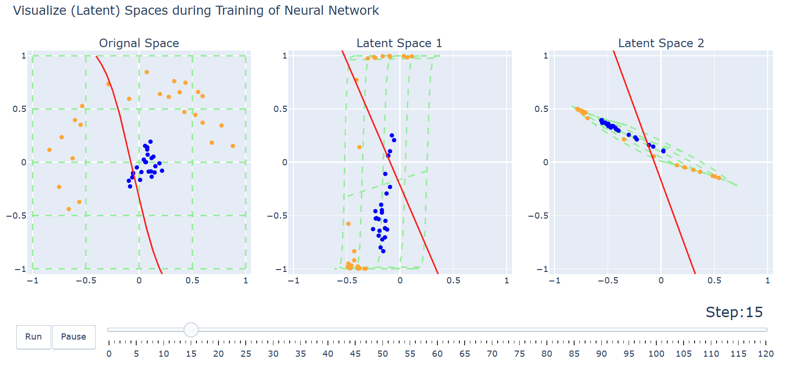

# Neural Network Visualization
Open visual.html to observe the training process of this simple MLP network, and how it makes the samples linearly separable through nonlinear transformations. 

Details: 

	1. Backward based on numpy;
	1. Dimensions of hidden layers are all 2, for visualization. 

requirements: numpy plotly

